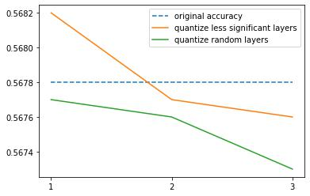

# PCA Based Model Modification

## Dependencies

- python == 3.7
- pytorch == 1.12.1
- numpy == 1.21.5
- thop == 0.1.1

## Implementation

#### Layer-wise Quantization Process
- Full process described in [quantization_conversion.ipynb](./quantization_conversion.ipynb)
- Calculate PCA explained variance ratio from compressed output for each activation layer from section 1 and 2
- Layer-wise quantization execution depicted in section 3
    - Note that the input is quantized back and forth for corresponding quantized/non-quantized layers
- Sample Metrics can be found in section 4


#### Training Script
        
- Available for Cifar10/Cifar100 training for vgg11/13/16/19
- Details in [train.py](./train.py)
        
``` bash
        python train.py --pretrained --dataset cifar10 --model vgg13
```

#### Experiment

- Experiment code using layer-wise quantization process
- Details in [collect_statistics.py](./collect_statistics.py)


#### Visualization

- graph/table extraction for quantization result is in [visualization.ipynb](./visualization.ipynb)


#### Demo Reseult (PCA)
|   | vgg16  | Vgg19  |  
|---|---|---|
| cifar 10  |   |   | 
| cifar 100  |   |   | 
